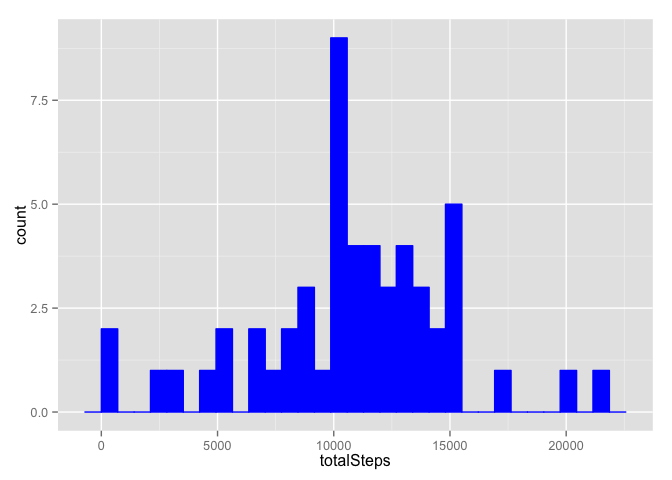
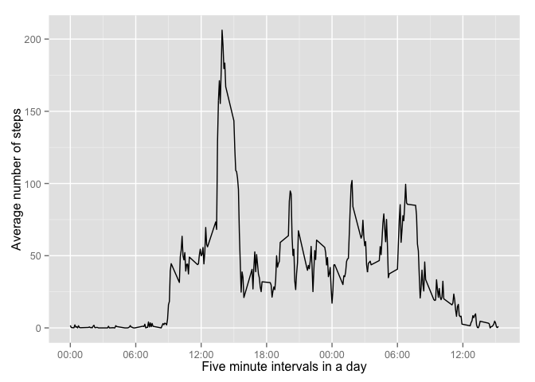
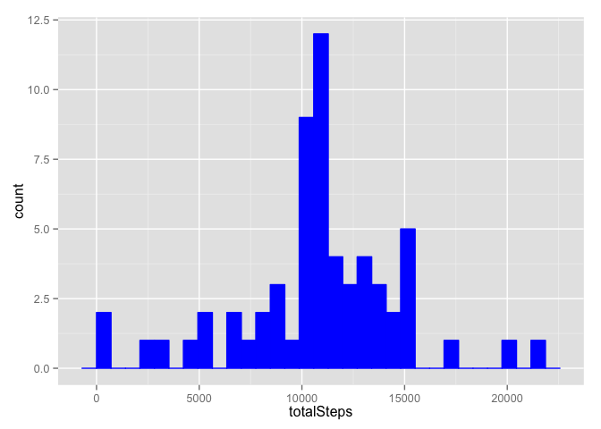
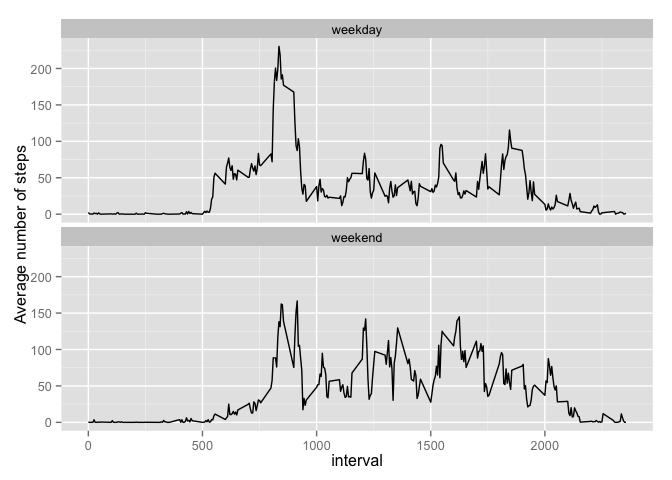

# Reproducible Research: Peer Assessment 1


## Loading and preprocessing the data
I read the data and after checking the summary I did not felt a need to preprocess it.

```r
data = read.csv('activity.csv')
summary(data)
```

```
##      steps                date          interval     
##  Min.   :  0.00   2012-10-01:  288   Min.   :   0.0  
##  1st Qu.:  0.00   2012-10-02:  288   1st Qu.: 588.8  
##  Median :  0.00   2012-10-03:  288   Median :1177.5  
##  Mean   : 37.38   2012-10-04:  288   Mean   :1177.5  
##  3rd Qu.: 12.00   2012-10-05:  288   3rd Qu.:1766.2  
##  Max.   :806.00   2012-10-06:  288   Max.   :2355.0  
##  NA's   :2304     (Other)   :15840
```


## What is mean total number of steps taken per day?
The total number of steps taken per day is

```r
library(dplyr)
```

```
## 
## Attaching package: 'dplyr'
## 
## The following object is masked from 'package:stats':
## 
##     filter
## 
## The following objects are masked from 'package:base':
## 
##     intersect, setdiff, setequal, union
```

```r
stepsPerDay = summarise(
            group_by(
              arrange(
                select(
                  filter(data, !is.na(steps)),
                  steps, date),
                date),
              date),
            totalSteps = sum(steps))
stepsPerDay
```

```
## Source: local data frame [53 x 2]
## 
##          date totalSteps
## 1  2012-10-02        126
## 2  2012-10-03      11352
## 3  2012-10-04      12116
## 4  2012-10-05      13294
## 5  2012-10-06      15420
## 6  2012-10-07      11015
## 7  2012-10-09      12811
## 8  2012-10-10       9900
## 9  2012-10-11      10304
## 10 2012-10-12      17382
## ..        ...        ...
```

A barplot of our data (total number of steps per day) would show a number of steps for each day. A histogram would show a distribution of a number of steps per day as below

```r
library(ggplot2)
ggplot(stepsPerDay, aes(x=totalSteps)) + geom_histogram(colour = 'blue', fill = 'blue')
```

```
## stat_bin: binwidth defaulted to range/30. Use 'binwidth = x' to adjust this.
```

 

The mean of the total number of steps per day is

```r
mean(stepsPerDay$totalSteps)
```

```
## [1] 10766.19
```

And the median of the total number of steps per day is

```r
median(stepsPerDay$totalSteps)
```

```
## [1] 10765
```


## What is the average daily activity pattern?
The average daily activity pattern can be seen in a time series plot below. After calculating the average number of steps in a five minute interval across all days I also transform notion of five time intervals into an hour:minute format. In the end I made a plot.

```r
fiveMins = summarise(
            group_by(
              arrange(data, interval),
              interval),
            steps = mean(steps, na.rm = TRUE))
mns <- function(m) {
  x <- m * 60
  return(x)
}
start = strptime('00:00', '%H:%M')
fiveMins$interval = start + mns(fiveMins$interval)
library(scales)
ggplot(fiveMins, aes(interval, steps)) + geom_line() + scale_x_datetime(labels = date_format('%H:%M')) + xlab('Five minute intervals in a day') + ylab('Average number of steps')
```

 

The maximum number of steps on average across all the days in the dataset have the below 5-minute interval

```r
fiveMins = summarise(
  group_by(
    arrange(data, interval),
    interval),
  steps = mean(steps, na.rm = TRUE))
fiveMins$interval[fiveMins$steps == max(fiveMins$steps)]
```

```
## [1] 835
```


## Imputing missing values
The total number of missing values in the dataset is

```r
nrow(data[is.na(data),])
```

```
## [1] 2304
```

I devised a strategy for filling in all of the missing data in the dataset: replacing them with the mean value in a five minute interval across all days. I stored the result in a new dataset.

```r
noNA = data
for (i in 1:nrow(noNA)) {
  if (is.na(noNA$steps[i])) {
    noNA$steps[i] = fiveMins$steps[fiveMins$interval == noNA$interval[i]]
  }
}
```

The histogram of the total number of steps taken each day is as below

```r
stepsPerDay1 = summarise(
  group_by(
    arrange(
      select(
        filter(noNA, !is.na(steps)),
        steps, date),
      date),
    date),
  totalSteps = sum(steps))

ggplot(stepsPerDay1, aes(x=totalSteps)) + geom_histogram(colour = 'blue', fill = 'blue')
```

```
## stat_bin: binwidth defaulted to range/30. Use 'binwidth = x' to adjust this.
```

 

The mean value is

```r
mean(stepsPerDay1$totalSteps)
```

```
## [1] 10766.19
```

And the median value is

```r
median(stepsPerDay1$totalSteps)
```

```
## [1] 10766.19
```

Only the median differ from original values. Imputing missing data on the estimates of the total daily number of steps enlarge the median value.

## Are there differences in activity patterns between weekdays and weekends?
I added a new factor variable indicating if a day is a weekday or a weekend.

```r
noNA$week = weekdays(as.Date(noNA$date))
noNA$week[noNA$week == 'ponedeljek'] = 'weekday'
noNA$week[noNA$week == 'torek'] = 'weekday'
noNA$week[noNA$week == 'sreda'] = 'weekday'
noNA$week[noNA$week == 'četrtek'] = 'weekday'
noNA$week[noNA$week == 'petek'] = 'weekday'
noNA$week[noNA$week == 'sobota'] = 'weekend'
noNA$week[noNA$week == 'nedelja'] = 'weekend'
noNA$week = factor(noNA$week)
```

Differences in activity patterns between weekdays and weekends are clearly noted in a panel plot below.

```r
fiveMins1 = summarise(
  group_by(
    arrange(noNA, week, interval),
    week, interval),
  steps = mean(steps))

ggplot(fiveMins1, aes(interval, steps)) + facet_wrap( ~ week, ncol = 1) + geom_line() + ylab('Average number of steps')
```

 
